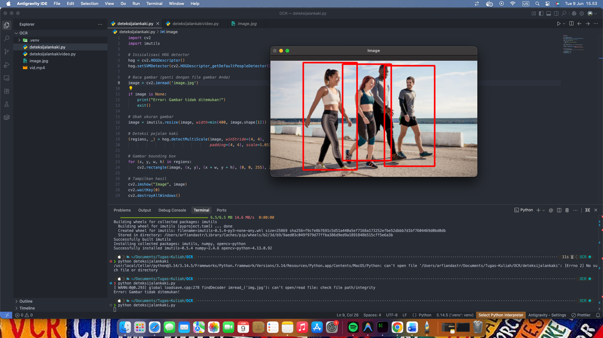

Berikut adalah file `README.md` untuk repository GitHub Anda.

````markdown
# Deteksi Pejalan Kaki menggunakan OpenCV

Program deteksi pejalan kaki berbasis Computer Vision menggunakan metode HOG (Histogram of Oriented Gradients) dan Linear SVM yang disediakan oleh OpenCV. Program ini dapat mendeteksi pejalan kaki pada gambar statis maupun video.

## Identitas

| Keterangan  | Isi                       |
| ----------- | ------------------------- |
| Nama        | Arfianda Firsta Satritama |
| NIM         | 312410377                 |
| Kelas       | I.24.1C                   |
| Mata Kuliah | Pengolahan Citra          |

## Daftar Isi

- [Deskripsi Program](#deskripsi-program)
- [Teknologi yang Digunakan](#teknologi-yang-digunakan)
- [Persyaratan Sistem](#persyaratan-sistem)
- [Instalasi](#instalasi)
- [Cara Penggunaan](#cara-penggunaan)
- [Struktur File](#struktur-file)
- [Penjelasan Kode](#penjelasan-kode)
- [Output Program](#output-program)
- [Referensi](#referensi)

## Deskripsi Program

Program ini memanfaatkan algoritma HOG (Histogram of Oriented Gradients) yang dikombinasikan dengan Linear SVM (Support Vector Machine) untuk mendeteksi keberadaan pejalan kaki dalam sebuah gambar atau video. Algoritma HOG bekerja dengan cara:

1. Menghitung gradien intensitas piksel pada setiap area gambar
2. Membuat histogram dari arah gradien tersebut
3. Membandingkan pola histogram dengan dataset latih yang telah disediakan OpenCV

OpenCV telah menyediakan model HOG + Linear SVM yang telah dilatih khusus untuk deteksi pejalan kaki, sehingga program dapat langsung digunakan tanpa perlu proses pelatihan ulang.

## Teknologi yang Digunakan

- Python 3.x
- OpenCV (cv2) - untuk operasi Computer Vision
- imutils - untuk mempermudah resize gambar
- HOG Descriptor - metode ekstraksi fitur
- Linear SVM - metode klasifikasi

## Persyaratan Sistem

- Python 3.6 atau lebih baru
- Webcam atau file video (opsional untuk deteksi video)
- RAM minimal 4GB direkomendasikan

## Instalasi

### 1. Clone Repository

```bash
git clone https://github.com/username/deteksi-pejalan-kaki.git
cd deteksi-pejalan-kaki
```
````

### 2. Buat Virtual Environment (Opsional namun direkomendasikan)

```bash
python -m venv .venv
source .venv/bin/activate   # Untuk Linux/Mac
.venv\Scripts\activate      # Untuk Windows
```

### 3. Install Dependencies

```bash
pip install opencv-python imutils
```

## Cara Penggunaan

### Deteksi pada Gambar

1. Pastikan file gambar (format .jpg atau .png) berada dalam folder yang sama dengan script
2. Jalankan program untuk gambar:

```bash
python deteksi_gambar.py
```

3. Tekan sembarang tombol pada keyboard untuk menutup jendela output

### Deteksi pada Video

1. Pastikan file video (format .mp4) berada dalam folder yang sama dengan script
2. Jalankan program untuk video:

```bash
python deteksi_video.py
```

3. Tekan tombol 'q' pada keyboard untuk menghentikan pemutaran video

## Struktur File

```
deteksi-pejalan-kaki/
│
├── deteksi_gambar.py          # Script untuk deteksi pada gambar
├── deteksi_video.py           # Script untuk deteksi pada video
├── image.jpg                  # Contoh gambar input
├── vid.mp4                    # Contoh video input
├── requirements.txt           # Daftar dependency
└── README.md                  # Dokumentasi proyek
```

## Penjelasan Kode

### Inisialisasi Detektor

```python
import cv2
import imutils

hog = cv2.HOGDescriptor()
hog.setSVMDetector(cv2.HOGDescriptor_getDefaultPeopleDetector())
```

Kode di atas menginisialisasi objek HOG descriptor dan memuat model SVM yang telah dilatih untuk mendeteksi manusia.

### Deteksi pada Gambar

```python
image = cv2.imread('image.jpg')
image = imutils.resize(image, width=min(400, image.shape[1]))

(regions, _) = hog.detectMultiScale(image, winStride=(4, 4),
                                    padding=(4, 4), scale=1.05)

for (x, y, w, h) in regions:
    cv2.rectangle(image, (x, y), (x + w, y + h), (0, 0, 255), 2)
```

Parameter `detectMultiScale`:

- `winStride` : jarak pergeseran window deteksi
- `padding` : tambahan piksel di sekitar window
- `scale` : faktor skala untuk deteksi multi-skala

### Deteksi pada Video

```python
cap = cv2.VideoCapture('vid.mp4')

while cap.isOpened():
    ret, image = cap.read()
    if not ret:
        break

    # Proses deteksi setiap frame
    (regions, _) = hog.detectMultiScale(image, winStride=(4, 4),
                                        padding=(4, 4), scale=1.05)

    for (x, y, w, h) in regions:
        cv2.rectangle(image, (x, y), (x + w, y + h), (0, 0, 255), 2)

    cv2.imshow("Image", image)

    if cv2.waitKey(25) & 0xFF == ord('q'):
        break
```

## Output Program

### Output Deteksi pada Gambar

Berikut adalah contoh hasil deteksi pejalan kaki pada gambar statis:



### Output Deteksi pada Video

Berikut adalah contoh hasil deteksi pejalan kaki pada video:

<video src="/screenshot/videoocr.mov" controls="controls" style="max-width: 730px;"></video>

## Keterbatasan Program

1. Model HOG bawaan OpenCV kurang akurat untuk pejalan kaki yang tertutup sebagian
2. Deteksi optimal untuk pejalan kaki dalam posisi berdiri tegak
3. Performa menurun pada resolusi video yang sangat tinggi
4. Mungkin terjadi false positive pada objek dengan bentuk menyerupai manusia

## Referensi

- Dalal, N., & Triggs, B. (2005). Histograms of Oriented Gradients for Human Detection. CVPR.
- OpenCV Documentation: https://docs.opencv.org/
- imutils Documentation: https://github.com/PyImageSearch/imutils

## Lisensi

Proyek ini dibuat untuk keperluan tugas mata kuliah Pengolahan Citra.
